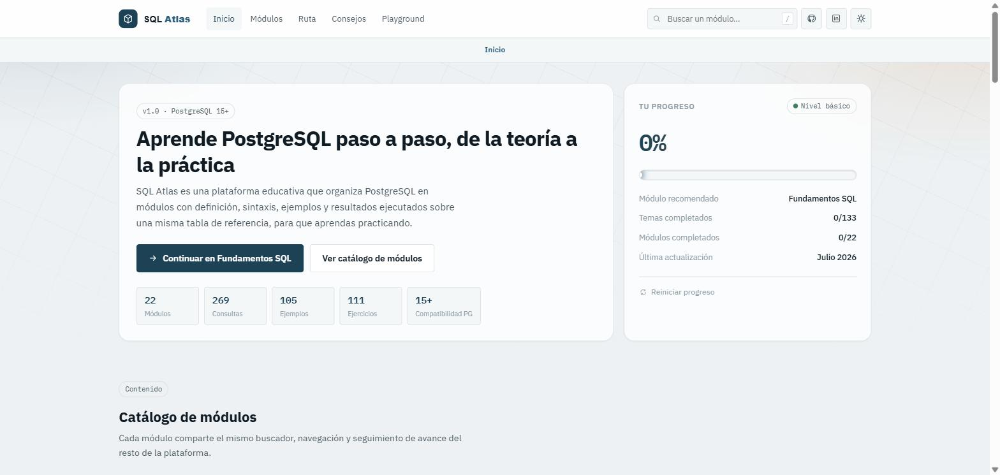
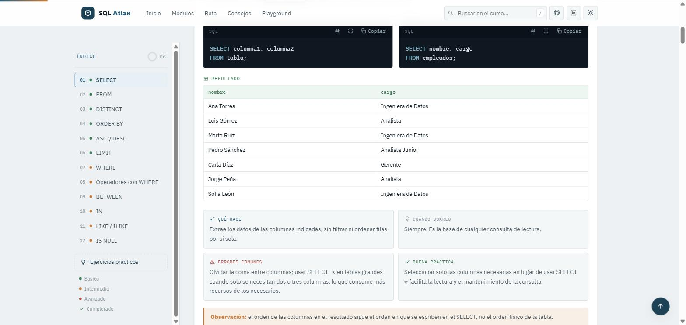
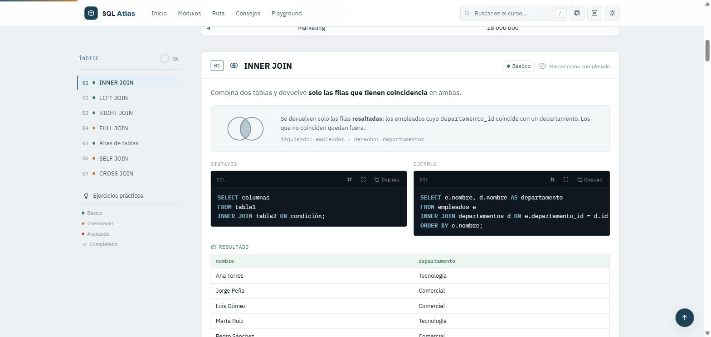
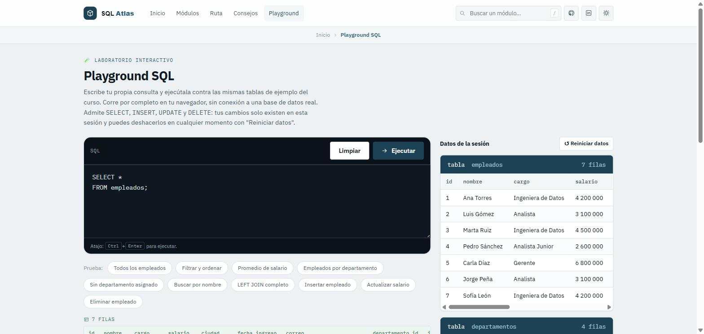

# SQL Atlas

**Plataforma interactiva para aprender PostgreSQL**, construida como un resumen práctico de mis propios conocimientos de SQL. Incluye 22 módulos con definición, sintaxis, ejemplos y resultados, ejercicios prácticos y un Playground SQL donde puedes escribir y ejecutar tus propias consultas.

**Demo en vivo:** https://leonararias23-beep.github.io/sql-atlas/



## Por qué hice este proyecto

Mientras repasaba SQL y PostgreSQL a fondo, quise ordenar todo lo que iba aprendiendo en un solo lugar, con la misma tabla de referencia usada de principio a fin y ejemplos que se pudieran ejecutar de verdad, no solo leer. En vez de un cuaderno de apuntes, terminó siendo esta plataforma. Me sirvió tanto para consolidar lo que ya sabía como para tener un material que pudiera compartir con quien también esté aprendiendo.

## Cómo se construyó

Quise usar este proyecto para poner en práctica mis conocimientos técnicos de SQL, organizándolos en una plataforma completa que fuera mucho más allá de un simple resumen de apuntes. Para construirla trabajé de la mano con **[Claude Code](https://claude.com/claude-code)**, el asistente de desarrollo de Anthropic, que fue clave en todo el proceso.

Avancé módulo por módulo. Yo definía qué temas cubrir, qué ejemplos usar, cómo debía sentirse la experiencia de aprendizaje y qué decisiones de diseño tenían sentido para el proyecto. Claude Code se encargó de traducir esas decisiones en código, desde la estructura de cada módulo hasta piezas más complejas como el motor SQL del Playground, un intérprete escrito completamente desde cero en JavaScript capaz de leer, entender y ejecutar consultas reales.

Esta forma de trabajar me permitió avanzar mucho más rápido de lo que habría logrado solo, revisando cada módulo antes de continuar con el siguiente y sin perder el control sobre las decisiones técnicas del proyecto. También fue una manera de comprobar de primera mano el valor real de este tipo de herramientas dentro de un flujo de desarrollo serio, algo que hoy considero una habilidad tan importante como el propio conocimiento técnico que quería demostrar con este proyecto.

## Cómo funciona la plataforma

### Ruta de aprendizaje

Los módulos están ordenados por dificultad y por sublenguaje de SQL. Cada módulo se desbloquea automáticamente cuando completas el 100% de los temas del módulo anterior, y tu progreso se guarda en el propio navegador, así que no necesitas crear ninguna cuenta. Si prefieres explorar libremente, también puedes entrar a cualquier módulo directamente desde el catálogo.

### Modo claro y oscuro

El botón de la esquina superior derecha cambia entre modo claro y modo oscuro en toda la plataforma, incluyendo los colores de cada módulo, los bloques de código y los diagramas.

### Ejemplo de módulo: SELECT

Cada tema sigue la misma estructura: una explicación corta, la sintaxis general, un ejemplo real, el resultado que produce esa consulta y cuatro tarjetas con qué hace, cuándo usarlo, errores comunes y una buena práctica.



### Ejemplo de módulo: JOIN

El módulo de JOINs va un paso más allá y agrega un diagrama de conjuntos para cada tipo de unión (INNER, LEFT, RIGHT, FULL), de forma que se entienda de un vistazo qué filas devuelve cada una antes de leer el código.



## Qué incluye

* **22 módulos** organizados por sublenguaje de SQL: DQL (consultar), DML (insertar, actualizar y eliminar), DDL (crear y modificar estructuras), TCL (transacciones), DCL (roles y permisos) y PL/pgSQL con triggers.
* **Ruta de aprendizaje** con progreso guardado localmente y desbloqueo progresivo entre módulos.
* **111+ ejercicios prácticos** de opción múltiple y de escritura para reforzar cada tema.
* **Playground SQL**, un intérprete de SQL escrito desde cero en JavaScript que corre `SELECT`, `INSERT`, `UPDATE` y `DELETE` de verdad contra datos de ejemplo en memoria, con reinicio de un clic.
* Modo claro y oscuro, buscador global y una identidad visual propia por módulo.



## Stack técnico

HTML, CSS y JavaScript, sin frameworks ni paso de build. Basta con abrir `index.html` con doble clic para que funcione. Publicado con GitHub Pages directamente desde este repositorio.

## Correrlo localmente

```bash
git clone https://github.com/leonararias23-beep/sql-atlas.git
cd sql-atlas
```

Y abre `index.html` en tu navegador. No necesita servidor ni instalar dependencias.

## Autor

**Nelson Leonardo Páez Arias**
[GitHub](https://github.com/leonararias23-beep) · [LinkedIn](https://www.linkedin.com/in/nelson-leonardo-paez-arias-b77865418)
